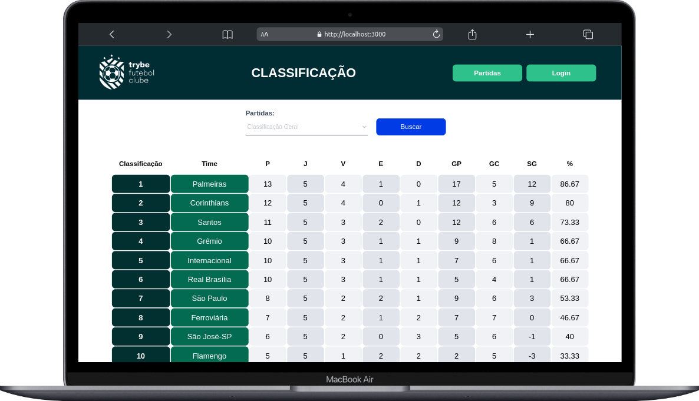
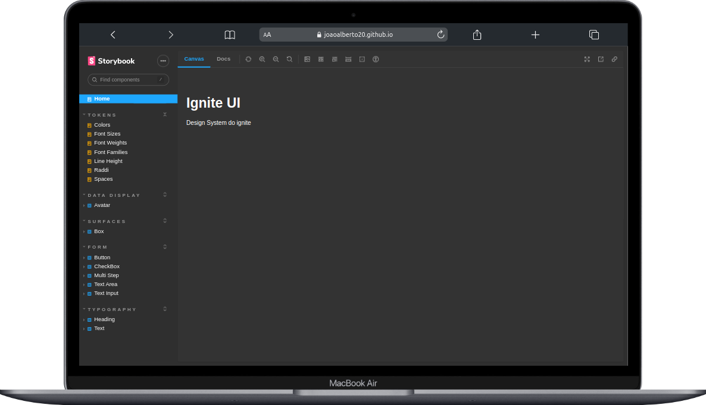
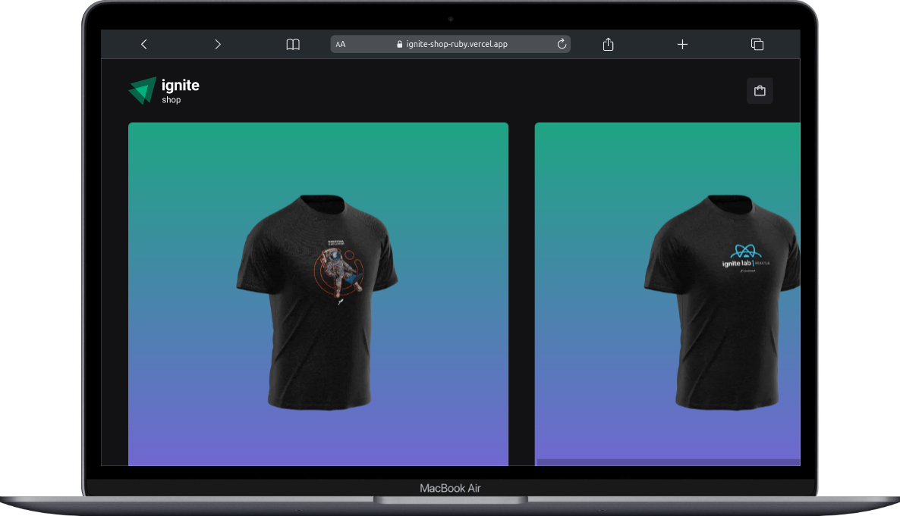

 

Eu sou um entusiasta de desenvolvimento de software. Minha paixão por essa área só cresce a cada dia e meu objetivo é sempre me capacitar e aprender mais sobre o mundo do desenvolvimento web.

Se você me perguntar por que escolhi essa área, vou te dizer que a programação me fascina e me motiva a trabalhar duro, muitas vezes virando noites para criar soluções inovadoras. Mas, na verdade, o que me atrai nessa profissão é a oportunidade de pensar, discutir planos, resolver problemas e criar soluções que possam impactar positivamente a vida das pessoas.

Se você está se perguntando se deve me chamar para uma conversa, não pense duas vezes! Estou sempre disposto a compartilhar conhecimento, aprender, trocar experiências e até mesmo jogar um game ou participar de um happy hour. Vamos conversar?

## Algumas coisas que são indispensáveis na minha vida :thinking:

- :robot: Uma delas é o meu fascínio por tecnologia e automação. Eu adoro ver como as indústrias criam processos de produção cada vez mais eficientes, com robôs cada vez mais avançados e sistemas automatizados impressionantes. Mas além disso, também sou apaixonado por inteligência artificial, machine learning, redes neurais e data science. Acho incrível como essas áreas estão em constante evolução e oferecem soluções cada vez mais inteligentes e eficientes para diversos problemas.

- :video_game: Jogos também são uma paixão minha. Embora eu não tenha um favorito específico, adoro jogos de tiro (no PC e no console) e jogos de estratégia de tabuleiro. É incrível como um bom jogo pode te transportar para um mundo completamente diferente e te desafiar de tantas formas diferentes.

- :desktop_computer: Atualmente, meu foco principal é no desenvolvimento web. Estou sempre codando e buscando aprender cada vez mais. Estou utilizando bastante o Node e focado em entender a arquitetura do sistema. Eu gosto de pensar na lógica por trás do código, reutilizar componentes e manter tudo organizado. Quando se trata de front-end, gosto de utilizar o React e pesquisar e aplicar novos elementos dentro dessa biblioteca, como Hooks, NestJS, Redux e Context API. Afinal, como dizem, conhecimento nunca é demais e estou sempre em busca de aprender mais e melhorar minhas habilidades. <a href="#projects">Dê uma olhada em alguns dos projetos que desenvolvi recentemente</a>

## Tecnologias e Ferramentas

 
  
  
  
  
  
  
  
  
  
  
  
  
  
  
  
  
  
  
  
  
  
  
  

 

## Social Network

 

<h1 id="projects" align="center">Meus Projetos</h1>

<table width="100%" >
    <tr>
      <td align="top">
        <h2 align="center">
          <a 
            href="https://github.com/JoaoAlberto20/trybe-futebol-fc" 
            target="_blank">
            Trybe Futebol Clube trophy 🏆
          </a>
        </h2>
        
         
         
        

          <em>
            <strong>
            :wrench: Ferramentas e Metodologias:
            </strong> 
            
 
              Node.js, Express, Typescript, MySQL, Sequelize e Docker
              OLID e Programação Orientada a Objetos Mocha, Chai, ChaiHTTP e Sinon
            

          </em>
        

        
Trybe Futebol Clube: Uma Projeto de uma tabela do Brasileirão 

      </td>
      <td align="top">
        <h2 align="center">
          <a 
            href="https://github.com/JoaoAlberto20/design-system" 
            target="_blank">
            Design System
          </a>
        </h2>
        
         
         
        

          <em>
            <strong>
            :wrench: Ferramentas e Metodologias:
            </strong> 
            
 
              Stitches, RadixUI, Storybook, TypeScript, React, ViteJs, TurboRepo,
              TurboRepo
            

          </em>
        

        
Portfolio: Aplicação de um Design System

      </td>
    </tr>
    <tr>
      <td valign="top">
        <h2 align="center">
          <a 
            href="https://github.com/JoaoAlberto20/ignite-shop" 
            target="_blank">
            ignite Shop
          </a>
        </h2>
        
         
         
        

          <em>
            <strong>
            :wrench: Ferramentas e Metodologias:
            </strong> 
            
 
              Next (functional components), Typescript, 
              Stitches, Axios, Striper, Radix, Context Api
            

          </em>
        

        
Ignite Shop: Aplicação de uma loja de roupa virtual

    </td>
    <td valign="top">
      <h2 align="center">
        <a 
          href="https://github.com/JoaoAlberto20/Timer-Pomodoro" 
          target="_blank">
          Timer Pomodoro
        </a>
      </h2>
      
       
       
      

        <em>
          <strong>
            :wrench: Ferramentas e Metodologias:
          </strong> 
          
 
            React (functional components), HTML, CSS, JavaScript,
            Phosphor-icons, Styled Components, React Hook Form, Date Fns,
            Eslint, Context Api, 
          

        </em>
      

      
Timer: gerenciamento de tempo

    </td>
  </tr>
  <tr>
    <td valign="top">
      <h2 align="center">
        <a 
          href="https://github.com/JoaoAlberto20/todoList" 
          target="_blank">
          Todo List
        </a>
      </h2>
      
       
       
      

        <em>
          <strong>
          :wrench: Ferramentas e Metodologias:
          </strong> 
          
 
            React (functional components), HTML, CSS, CSS-MODULE JavaScript e Phosphor-icons 
          

        </em>
      

      
Aplicação para cadastro de tarefas

    </td>
  </tr>
</table>

 

 

  

<a href="https://github.com/JoaoAlberto20">
  
 
   
      

      

