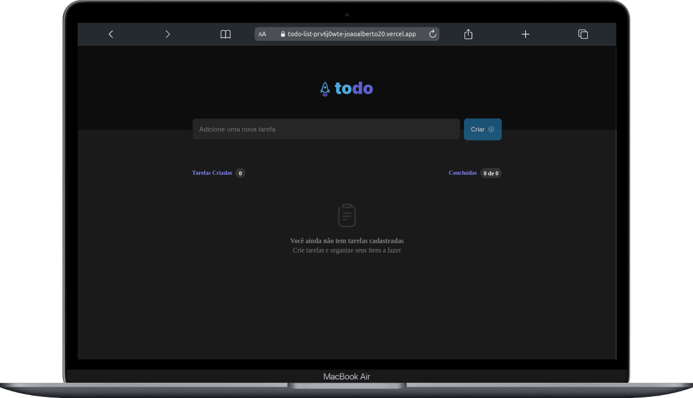

<h3> :woman: &nbsp;Sobre mim </h3>

- 🤔 &nbsp; Explorando novas tecnologias e desenvolvendo soluções de software.
- 🎓 &nbsp; Estudando **Desenvolvimento Web Full Stack** na <a href="https://www.betrybe.com/" target="_blank" >Trybe</a>.
- 🌱 &nbsp; Aprendendo mais sobre **React Native**.

<h3> :earth_americas: &nbsp;Onde me encontrar: </h3> 

<h3> :rocket: &nbsp;Minhas Skills </h3>

**Aplicações e Dados**

  
  
  
  
  
  
  

**Utilidades**

  
  

**DevOps**

  
  
  

**Ferramentas de Desenvolvimento**

  
  
  

<h1 align="center">Meus Projetos</h1>

<table width="100%" >
    <tr>
      <td valign="top">
        <h2 align="center">
          <a 
            href="https://github.com/JoaoAlberto20/github-blog" 
            target="_blank">
            GitHub Blog
          </a>
        </h2>
        
         
         
        

          <em>
            <strong>
            :wrench: Ferramentas e Metodologias:
            </strong> 
            
 
              React (functional components), HTML, CSS, JavaScript, React Icons, Typescript, Styled Components, React Router Dom, React Hook Form , 
              Axios, API do Github, FontAwesomeIcon
            

          </em>
        

        
Portfolio: Aplicação de um Blog pessoal

      </td>
      <td valign="top">
        <h2 align="center">
          <a 
            href="https://github.com/JoaoAlberto20/Timer-Pomodoro" 
            target="_blank">
            Timer Pomodoro
          </a>
        </h2>
        
         
         
        

          <em>
            <strong>
            :wrench: Ferramentas e Metodologias:
            </strong> 
            
 
              React (functional components), HTML, CSS, JavaScript,
              Phosphor-icons, Styled Components, React Hook Form, Date Fns,
              Eslint, Context Api, 
            

          </em>
        

        
Timer: gerenciamento de tempo

      </td>
    </tr>
    <tr  style="display: grid; grid-template-columns: 1fr 1fr;" >
      <td valign="top">
        <h2 align="center">
          <a 
            href="https://github.com/JoaoAlberto20/my-portfolio" 
            target="_blank">
            Meu portfolio
          </a>
        </h2>
        
         
         
        

          <em>
            <strong>
            :wrench: Ferramentas e Metodologias:
            </strong> 
            
 
              React (functional components), HTML, CSS, JavaScript e React Icons, Typescript, Styled Components, Emailjs, 
            

          </em>
        

        
Portfolio: Aplicação de um portfolio pessoal

      </td>
     <td valign="top">
      <h2 align="center">
        <a 
          href="https://github.com/JoaoAlberto20/coffeeDelivery" 
          target="_blank">
          Coffee Delivery
        </a>
      </h2>
      
       
       
      

        <em>
          <strong>
          :wrench: Ferramentas e Metodologias:
          </strong> 
          
 
            React (functional components), HTML, CSS, JavaScript,
            Phosphor-icons, Styled Components, React Hook Form, Zod,
            Eslint, Context Api, Reducer 
          

        </em>
      

      
Timer: Uma aplicação para gerenciar  um carrinho de compras

    </td>
  </tr>
  <tr style="display: grid; grid-template-columns: 1fr 1fr;" >
    <td valign="top">
      <h2 align="center">
        <a 
          href="https://github.com/JoaoAlberto20/todoList" 
          target="_blank">
          Todo List
        </a>
      </h2>
      
       
       
      

        <em>
          <strong>
          :wrench: Ferramentas e Metodologias:
          </strong> 
          
 
            React (functional components), HTML, CSS, CSS-MODULE JavaScript e Phosphor-icons 
          

        </em>
      

      
Aplicação para cadastro de tarefas

    </td>
  </tr>
</table>
 

  <a href="https://github.com/JoaoAlberto20">
  
  

